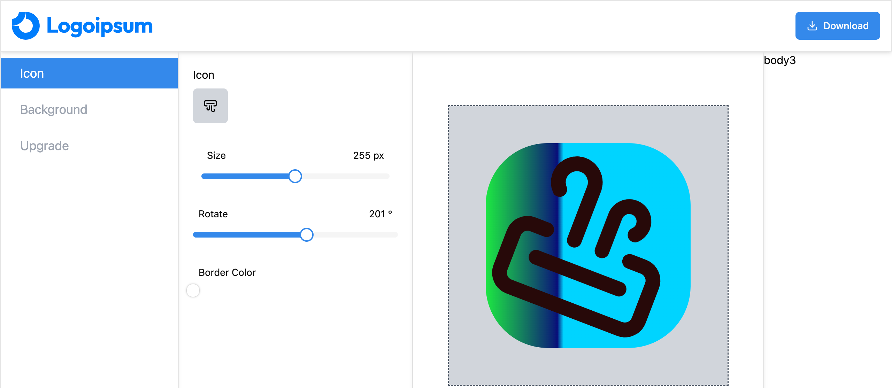

# React + Vite

  <h3 align="center">Sahreen Logo Maker App</h3>

This template provides a minimal setup to get React working in Vite with HMR and some ESLint rules.

- React.js
- Shadcn/ui
- Tailwind CSS
- emoji-picker-react
- html2canvas
